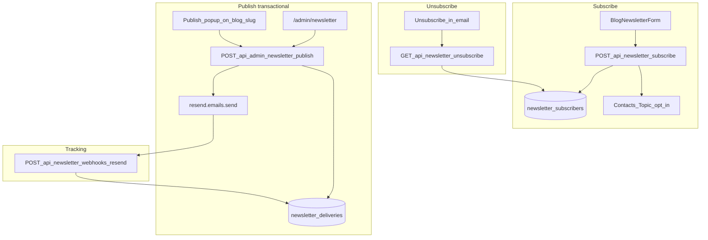

# Newsletter — Transactional send + DB tracking

Plan thống nhất: subscribe trên `/blog`, gửi bài qua **transactional API**, tracking per-email trong Neon, unsubscribe signed.

## Hiện trạng vs còn lại

| Phần | Trạng thái |
|------|------------|
| Migration `004` + Drizzle schema | ✅ |
| Subscribe API + `BlogNewsletterForm` + `BlogPageAside` | ✅ |
| Unsubscribe signed (`GET /api/newsletter/unsubscribe`) | ✅ |
| Webhook Resend → `newsletter_deliveries` | ✅ (handler sẵn; deliveries tăng khi Publish) |
| `publishPost()` + email template + admin publish API | ⏳ Phase 2 |
| `/admin/newsletter` + `BlogPublishButton` | ⏳ Phase 3 |
| Welcome email (optional) | ⏳ Phase 4 |

**Đã có:** `lib/newsletter/{config,parse,subscribe,unsubscribe,unsubscribe-token,resend-contact,delivery}.ts`, `app/api/newsletter/{subscribe,unsubscribe,webhooks/resend}/route.ts`, `components/BlogNewsletterForm.tsx`.

**Chưa có:** `lib/newsletter/publish.ts`, `email-template.ts`, `app/api/admin/newsletter/**`, `BlogPublishButton`, `app/admin/newsletter/page.tsx`.

---

## Quyết định: Transactional email (chốt)

**Gửi bài newsletter = `resend.emails.send` (Transactional), không dùng Broadcast / Marketing send làm luồng chính.**

| Resend product | Dùng cho | Không dùng cho |
|----------------|----------|----------------|
| **Transactional** (`emails.send`) | Publish từng bài → từng subscriber; welcome email (optional); contact form (đã có) | — |
| **Marketing Contacts + Topics** | Sync opt-in khi subscribe; opt-out khi unsubscribe (compliance Resend) | Gửi bài hàng loạt |
| **Segments / Broadcasts** | *(optional, dashboard only)* | Luồng Publish trên site; tracking matrix |

**Lý do chốt transactional:**
- Neon giữ matrix **(post_slug × email)** + idempotent retry — Resend Broadcast không có.
- Publish lại bài cũ chỉ gửi subscriber/delivery **thiếu** (`pending` / `failed`).
- Webhook map `email_id` + tags `delivery_id`, `post_slug` về từng row DB.
- List nhỏ (<1k): Free transactional (~3k email/tháng, **100/ngày**) đủ; cùng quota với contact form.

**Free tier cần nhớ:** 1 lần Publish N subscriber = N email transactional. List >100 → batch qua ngày hoặc nâng Pro transactional. Marketing Free **1k contacts** dư cho subscribe sync; **Segment 1/3** không ảnh hưởng luồng này.

**Inbox người nhận:** transactional vs marketing trên Resend **không đổi UI inbox** — cùng From/domain; Gmail có thể xếp Promotions/Updates theo nội dung newsletter.

---

## SaaS stack

| Thành phần | Vai trò |
|-----------|---------|
| **Resend Transactional** | `emails.send` mỗi subscriber khi Publish |
| **Resend Contacts/Topics** | Opt-in subscribe, opt-out unsubscribe (không thay DB) |
| **Neon + Drizzle** | **Source of truth** — subscribers, deliveries, idempotency |
| **ALTCHA** | Anti-spam form subscribe |
| **ADMIN_SECRET** | Admin hub + popup Publish |

Resend không lưu “email X đã nhận bài Y” — chỉ events/logs. Business rules nằm ở DB.



---

## Resend dashboard (one-time)

1. **Topic** `Blog updates` (**Opt-in**) → `RESEND_NEWSLETTER_TOPIC_ID` (subscribe sync).
2. **Webhook** → `https://chunhuduc.com/api/newsletter/webhooks/resend`  
   Events: `email.sent`, `email.delivered`, `email.failed`, `email.bounced`, `email.complained` → `RESEND_WEBHOOK_SECRET`.
3. **Không bắt buộc:** Segment, Broadcast campaign trên dashboard.

Docs: [Contacts](https://resend.com/docs/dashboard/audiences/contacts), [Topics](https://resend.com/docs/dashboard/topics/introduction), [Send Email API](https://resend.com/docs/api-reference/emails/send-email), [Webhooks](https://resend.com/docs/webhooks/introduction).

---

## Data model (Neon)

Migration: [`supabase/migrations/004_newsletter.sql`](supabase/migrations/004_newsletter.sql) + [`lib/db/schema.ts`](lib/db/schema.ts).

### `newsletter_subscribers`
- `email` UNIQUE, `status` active|unsubscribed, `resend_contact_id`, timestamps

### `newsletter_posts`
- `slug` PK, `title`, `summary`, publish metadata

### `newsletter_deliveries`
- `post_slug`, `subscriber_id`, `email`, `status`, `resend_email_id`
- **`UNIQUE(post_slug, email)`**

### Quy tắc Publish (idempotent)

Publish slug `X`:
1. Upsert `newsletter_posts` từ [`lib/posts.ts`](lib/posts.ts).
2. Subscribers `active` → `INSERT` delivery `ON CONFLICT DO NOTHING`.
3. Gửi **transactional** chỉ `pending` / `failed` (skip `delivered`).
4. Mỗi send: `resend.emails.send` + tags `{ post_slug, delivery_id }` → `sent` + `resend_email_id`.
5. Webhook → `delivered` / `failed` / `bounced` / `complained`.

Publish lại: subscriber mới được gửi; đã `delivered` → skip. Quét bài cũ = Publish lại slug đó (DB quyết định ai thiếu).

---

## API routes

| Route | Auth | Trạng thái |
|-------|------|------------|
| `POST /api/newsletter/subscribe` | ALTCHA + rate limit | ✅ |
| `GET /api/newsletter/unsubscribe?token=` | HMAC signed | ✅ |
| `POST /api/newsletter/webhooks/resend` | Svix | ✅ |
| `POST /api/admin/newsletter/publish` | Admin cookie hoặc `{ secret }` | ⏳ |
| `GET /api/admin/newsletter/posts` | Admin | ⏳ |
| `GET /api/admin/newsletter/posts/[slug]/deliveries` | Admin | ⏳ |

Helpers: [`lib/newsletter/`](lib/newsletter/) — thêm `publish.ts`, `email-template.ts` ở Phase 2.

---

## Subscribe flow (✅)

- DB insert/reactivate → `syncResendContactOptIn` (Contacts + Topic)
- UI: [`BlogNewsletterForm.tsx`](components/BlogNewsletterForm.tsx) trong [`BlogPageAside.tsx`](components/BlogPageAside.tsx)

---

## Publish (⏳ Phase 2–3)

### Core — `lib/newsletter/publish.ts`
- Batch `NEWSLETTER_PUBLISH_BATCH_SIZE` (default 25) — tránh timeout Vercel **và** gói Free 100 email/ngày (log warning nếu batch > remaining daily quota).
- Trả về `{ sent, skipped, failed }`.

### Email template — `lib/newsletter/email-template.ts`
- Subject: `New post: {title}`
- HTML + text, CTA `/blog/{slug}`, footer unsubscribe (signed token)
- From: `CONTACT_FROM_EMAIL` / `CONTACT_FROM_NAME`

### Admin hub — `/admin/newsletter`
- Pattern [`app/admin/knowledge/page.tsx`](app/admin/knowledge/page.tsx)
- Bảng bài + stats + Publish + chi tiết deliveries

### Popup — [`BlogPublishButton.tsx`](components/BlogPublishButton.tsx) trên [`app/blog/[slug]/page.tsx`](app/blog/[slug]/page.tsx)

---

## Env

```env
RESEND_API_KEY=                      # transactional + contacts API
DATABASE_URL=
ADMIN_SECRET=
CONTACT_FROM_EMAIL=
CONTACT_FROM_NAME=

RESEND_NEWSLETTER_TOPIC_ID=          # subscribe/opt-out sync (Marketing Contacts)
RESEND_WEBHOOK_SECRET=               # transactional webhook events
NEWSLETTER_UNSUBSCRIBE_SECRET=       # openssl rand -hex 32
NEWSLETTER_PUBLISH_BATCH_SIZE=25
NEWSLETTER_WELCOME_ENABLED=true      # optional, transactional welcome on subscribe
```

---

## Phases

### Phase 1 — Foundation ✅

Migration, Drizzle, subscribe, unsub, webhook, form, `.env.example` + README newsletter section.

#### Verification audit (2026-05-27)

| Hạng mục | Plan | Implementation | Ghi chú |
|----------|------|----------------|---------|
| Migration `004_newsletter.sql` | 3 bảng + indexes + UNIQUE(post_slug, email) | ✅ Khớp | Partial index `resend_email_id` trong SQL; Drizzle dùng full index — không ảnh hưởng runtime |
| Drizzle `lib/db/schema.ts` | newsletter_* tables + types | ✅ Khớp | |
| Subscribe API | ALTCHA, rate limit, honeypot, DB, Resend opt-in | ✅ | `POST /api/newsletter/subscribe`, `lib/newsletter/{parse,subscribe,resend-contact}.ts` |
| Unsubscribe | HMAC token, HTML page, DB + Resend opt-out | ✅ | `createUnsubscribeToken` sẵn cho Phase 2 email; chưa có UI gửi link (đúng scope) |
| Webhook | Svix verify, 5 email events → deliveries | ✅ | Handler no-op nếu chưa có delivery row (Publish Phase 2) |
| Form UI | Client form + BlogPageAside | ✅ | Wired qua `BlogPageMainSplit` trên `/blog` |
| `.env.example` | Topic, webhook, unsub secret | ✅ | |
| README | Setup + Phase 1 ops table | ✅ | |
| `npm run build` | pass | ✅ | 3 newsletter routes registered |

**Hành vi cần biết (không phải bug):**
- Subscribe cần `DATABASE_URL`; `RESEND_API_KEY` optional (skip contact sync nếu thiếu).
- Nếu có `RESEND_API_KEY` mà sync fail → API 502 dù row DB có thể đã insert (retry subscribe idempotent).
- Webhook/delivery matrix chỉ có data sau Phase 2 Publish.
- Manual E2E Phase 1: chạy migration 004 trên Neon + set env → test subscribe/unsubscribe (token generate qua `createUnsubscribeToken` tạm thời hoặc sau Phase 2 email).

### Phase 2 — Publish (transactional)
`publishPost()`, email template, `POST /api/admin/newsletter/publish`, admin read APIs.

### Phase 3 — Admin UI
`/admin/newsletter`, `BlogPublishButton`.

### Phase 4 — Polish
Welcome email (transactional), E2E checklist, rate limit publish.

---

## Không làm trong scope

- Resend **Broadcast** làm luồng chính
- Segment bắt buộc trên dashboard
- JWT admin dashboard
- Auto-publish on deploy
- Force resend người đã `delivered` (nút riêng sau)

---

## Kiểm thử

**Phase 1 (manual):**
1. Subscribe → row trong `newsletter_subscribers` + Resend contact opted-in.
2. Unsubscribe link → `unsubscribed` + Resend opt-out.
3. `npm run build` pass.

**Sau Phase 2–3:**
4. Publish slug A → N delivery; N× transactional send; webhook → `delivered`.
5. Publish lại A → skip delivered; subscriber mới → chỉ người mới.
6. Publish bài cũ cho subscriber mới subscribe sau → chỉ gửi delivery thiếu.
7. Publish popup secret sai → 401.

---

## Files

| File | Phase | Trạng thái |
|------|-------|------------|
| `supabase/migrations/004_newsletter.sql` | 1 | ✅ |
| `lib/db/schema.ts` | 1 | ✅ |
| `lib/newsletter/{config,parse,subscribe,unsubscribe,unsubscribe-token,resend-contact,delivery}.ts` | 1 | ✅ |
| `app/api/newsletter/subscribe/route.ts` | 1 | ✅ |
| `app/api/newsletter/unsubscribe/route.ts` | 1 | ✅ |
| `app/api/newsletter/webhooks/resend/route.ts` | 1 | ✅ |
| `components/BlogNewsletterForm.tsx` | 1 | ✅ |
| `lib/newsletter/{publish,email-template}.ts` | 2 | ⏳ |
| `app/api/admin/newsletter/**` | 2 | ⏳ |
| `components/BlogPublishButton.tsx` | 3 | ⏳ |
| `app/admin/newsletter/page.tsx` | 3 | ⏳ |
