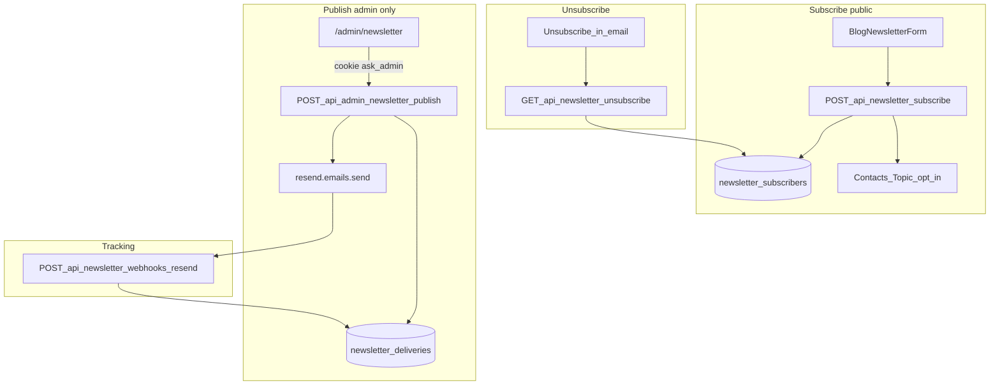

# Newsletter — Transactional send + DB tracking

Plan thống nhất: subscribe trên `/blog`, gửi bài qua **transactional API**, tracking per-email trong Neon, unsubscribe signed. **Publish chỉ từ `/admin/newsletter`.**

## Hiện trạng vs còn lại

| Phần | Trạng thái |
|------|------------|
| Migration `004` + Drizzle schema | ✅ |
| Subscribe API + `BlogNewsletterForm` + `BlogPageAside` | ✅ |
| Unsubscribe signed (`GET /api/newsletter/unsubscribe`) | ✅ |
| Webhook Resend → `newsletter_deliveries` | ✅ (handler sẵn; deliveries tăng khi Publish) |
| `publishPost()` + email template + admin publish/read APIs | ✅ Phase 2 |
| `/admin/newsletter` hub (Publish + stats + deliveries) | ✅ Phase 2 |
| Welcome email (optional) | ⏳ Phase 3 |

**Đã có:** `lib/newsletter/{config,parse,subscribe,unsubscribe,unsubscribe-token,resend-contact,delivery,publish,email-template,admin-guard}.ts`, `app/api/newsletter/**`, `app/api/admin/newsletter/**`, `components/BlogNewsletterForm.tsx`, `app/admin/newsletter/page.tsx`.

**Đã bỏ khỏi scope:** `BlogPublishButton`, modal secret trên `/blog/[slug]`, publish API auth qua `{ secret }` trong body.

---

## Quyết định: Transactional email (chốt)

**Gửi bài newsletter = `resend.emails.send` (Transactional), không dùng Broadcast / Marketing send làm luồng chính.**

| Resend product | Dùng cho | Không dùng cho |
|----------------|----------|----------------|
| **Transactional** (`emails.send`) | Publish từng bài → từng subscriber; welcome email (optional); contact form (đã có) | — |
| **Marketing Contacts + Topics** | Sync opt-in khi subscribe; opt-out khi unsubscribe (compliance Resend) | Gửi bài hàng loạt |
| **Segments / Broadcasts** | *(optional, dashboard only)* | Luồng Publish trên site; tracking matrix |

**Free tier:** ~3k email/tháng transactional, **100/ngày** — batch publish theo `NEWSLETTER_PUBLISH_BATCH_SIZE` (default 25).

---

## Quyết định: Publish chỉ `/admin` (chốt)

| Trước | Sau |
|-------|-----|
| Admin hub + popup Publish trên `/blog/[slug]` | **Chỉ** `/admin/newsletter` |
| Publish API: admin cookie **hoặc** `{ secret }` body | Publish API: **`verifyAdminCookie` only** ([`lib/admin-auth.ts`](lib/admin-auth.ts)) |
| `BlogPublishButton` trên trang bài public | **Không làm** — public site không lộ nút/action publish |

**Lý do:** tránh lộ surface publish trên trang public; cùng pattern login với [`/admin/knowledge`](app/admin/knowledge/page.tsx), [`/admin/chat`](app/admin/chat/page.tsx).

---

## SaaS stack

| Thành phần | Vai trò |
|-----------|---------|
| **Resend Transactional** | `emails.send` mỗi subscriber khi Publish |
| **Resend Contacts/Topics** | Sync subscribe/unsub (phụ; DB là chính) |
| **Neon + Drizzle** | Source of truth — subscribers, deliveries |
| **ALTCHA** | Anti-spam subscribe |
| **ADMIN_SECRET** | Login `/admin/*` → cookie `ask_admin` |



---

## Data model (Neon) — không đổi Phase 2

Migration [`004_newsletter.sql`](supabase/migrations/004_newsletter.sql) + [`lib/db/schema.ts`](lib/db/schema.ts) đã có đủ 3 bảng.

### Quy tắc Publish (idempotent)

Publish slug `X` (từ admin):
1. Upsert `newsletter_posts` từ [`lib/posts.ts`](lib/posts.ts) (`getPostBySlug` / `getAllPostsMeta`).
2. Subscribers `status = active`.
3. `INSERT newsletter_deliveries … ON CONFLICT (post_slug, email) DO NOTHING`.
4. Gửi transactional chỉ row `pending` / `failed` (skip `delivered`).
5. Mỗi send: `resend.emails.send` + tags `{ post_slug, delivery_id }` → update `sent`, `resend_email_id`.
6. Webhook (Phase 1 ✅) → `delivered` / `failed` / `bounced` / `complained`.

Publish lại cùng slug: subscriber mới → gửi; đã `delivered` → skip. Quét bài cũ = bấm Publish lại trên admin.

---

## API routes

| Route | Auth | Trạng thái |
|-------|------|------------|
| `POST /api/newsletter/subscribe` | ALTCHA + rate limit | ✅ |
| `GET /api/newsletter/unsubscribe?token=` | HMAC signed | ✅ |
| `POST /api/newsletter/webhooks/resend` | Svix | ✅ |
| `POST /api/admin/newsletter/publish` | **`verifyAdminCookie`** | ✅ |
| `GET /api/admin/newsletter/posts` | **`verifyAdminCookie`** | ✅ |
| `GET /api/admin/newsletter/posts/[slug]/deliveries` | **`verifyAdminCookie`** | ✅ |

Pattern auth: giống [`app/api/admin/gaps/route.ts`](app/api/admin/gaps/route.ts) — 401 nếu không có cookie hợp lệ.

---

## Phase 2 — Publish + Admin (verify scope)

### 2a. Core — `lib/newsletter/publish.ts`

- `publishPost(slug: string)` → `{ sent, skipped, failed, errors? }`
- Đọc markdown → upsert `newsletter_posts`
- Với mỗi active subscriber: ensure delivery row → send nếu eligible
- Batch size: `NEWSLETTER_PUBLISH_BATCH_SIZE` (default 25)
- Sequential hoặc parallel nhỏ trong batch; tránh timeout Vercel (~10s serverless)
- Resend fail trên 1 email → `failed` + `error_message`, tiếp tục batch

**Phụ thuộc Phase 1:** `delivery.ts` webhook, `unsubscribe-token.ts` (`createUnsubscribeToken`, `buildUnsubscribeUrl`).

### 2b. Email template — `lib/newsletter/email-template.ts`

- `buildNewsletterEmail({ slug, title, summary, subscriberId })` → `{ subject, html, text }`
- Subject: `New post: {title}`
- CTA → `{siteUrl}/blog/{slug}`
- Footer unsubscribe: `buildUnsubscribeUrl(createUnsubscribeToken(subscriberId))`
- From: `CONTACT_FROM_EMAIL` / `CONTACT_FROM_NAME` ([`lib/contact.ts`](lib/contact.ts) pattern)

### 2c. Admin APIs — `app/api/admin/newsletter/`

| File | Method | Body / query | Response |
|------|--------|--------------|----------|
| `publish/route.ts` | POST | `{ slug }` | `{ sent, skipped, failed }` |
| `posts/route.ts` | GET | — | Mọi slug từ `getAllPostsMeta()` + stats delivery từ DB (left join `newsletter_posts`) |
| `posts/[slug]/deliveries/route.ts` | GET | — | List deliveries: email, status, timestamps |

Stats gợi ý per post: `{ delivered, failed, pending, sent, totalActiveSubscribers }`.

**Posts chưa từng publish:** vẫn hiện trong list (slug từ markdown); stats toàn `pending`/0 cho đến lần Publish đầu.

### 2d. Admin UI — `app/admin/newsletter/page.tsx`

- Client page, pattern [`app/admin/knowledge/page.tsx`](app/admin/knowledge/page.tsx):
  1. Form login `ADMIN_SECRET` → `POST /api/admin/login` → cookie
  2. Bảng posts: slug, title, stats, nút **Publish** (confirm optional)
  3. Expand row / panel: danh sách deliveries (`GET .../deliveries`)
  4. Sau Publish: refresh stats + toast/message `{ sent, skipped, failed }`

**Không** thêm component publish vào [`app/blog/[slug]/page.tsx`](app/blog/[slug]/page.tsx) hay [`components/BlogPageAside.tsx`](components/BlogPageAside.tsx).

### 2e. Env / docs (Phase 2)

- `.env.example` / README: nhấn mạnh publish cần `ADMIN_SECRET` + đăng nhập admin; webhook + transactional quota
- Không document popup secret trên blog

### Phase 2 checklist (implementation verify)

| # | Hạng mục | Done khi |
|---|----------|----------|
| 1 | `publishPost` idempotent | Publish 2 lần → lần 2 skip `delivered` |
| 2 | Subscriber mới sau publish | Publish lại → chỉ gửi người thiếu delivery |
| 3 | Unsubscribed skip | Không insert/send cho `unsubscribed` |
| 4 | Email có unsub link hợp lệ | Token verify + GET unsub hoạt động |
| 5 | Resend tags | Webhook cập nhật đúng row qua `delivery_id` |
| 6 | Admin cookie | Publish/list/deliveries 401 không login |
| 7 | Public blog | **Không** có nút/modal publish |
| 8 | `npm run build` | pass |

---

## Phase 3 — Polish

- Welcome email on subscribe (`NEWSLETTER_WELCOME_ENABLED`, transactional)
- Rate limit riêng cho `POST .../publish` (optional)
- E2E manual checklist production

---

## Env

```env
RESEND_API_KEY=
DATABASE_URL=
ADMIN_SECRET=                         # /admin/newsletter login only
CONTACT_FROM_EMAIL=
CONTACT_FROM_NAME=

RESEND_NEWSLETTER_TOPIC_ID=           # subscribe sync (optional)
RESEND_WEBHOOK_SECRET=
NEWSLETTER_UNSUBSCRIBE_SECRET=
NEWSLETTER_PUBLISH_BATCH_SIZE=25
NEWSLETTER_WELCOME_ENABLED=true       # Phase 3 optional
```

---

## Không làm trong scope

- **Publish UI trên public site** (`BlogPublishButton`, secret modal trên `/blog/**`)
- Publish API auth qua `{ secret }` body (chỉ cookie admin)
- Resend Broadcast làm luồng chính
- JWT admin dashboard (sau)
- Auto-publish on deploy
- Force resend người đã `delivered`

---

## Kiểm thử

**Phase 1 ✅** — xem audit 2026-05-27 bên dưới.

**Phase 2 (sau implement):**
1. Login `/admin/newsletter` với `ADMIN_SECRET`.
2. Publish slug A → N transactional sends; Neon N deliveries; webhook → `delivered`.
3. Publish lại A → `skipped` cho delivered; subscriber mới → chỉ người mới.
4. Publish bài cũ (subscriber subscribe sau) → chỉ delivery thiếu.
5. Gọi publish API không cookie → 401.
6. `/blog` và `/blog/[slug]` — không có control publish.
7. `npm run build` pass.

---

## Phase 1 — Foundation ✅ (audit 2026-05-27)

| Hạng mục | Implementation |
|----------|----------------|
| Migration + Drizzle | ✅ |
| Subscribe + form | ✅ |
| Unsubscribe + token helpers | ✅ |
| Webhook handler | ✅ |
| Docs env | ✅ |

---

## Files

| File | Phase | Trạng thái |
|------|-------|------------|
| `lib/newsletter/{config,parse,subscribe,unsubscribe,unsubscribe-token,resend-contact,delivery}.ts` | 1 | ✅ |
| `app/api/newsletter/**` | 1 | ✅ |
| `components/BlogNewsletterForm.tsx` | 1 | ✅ |
| `lib/newsletter/publish.ts` | 2 | ✅ |
| `lib/newsletter/email-template.ts` | 2 | ✅ |
| `app/api/admin/newsletter/publish/route.ts` | 2 | ✅ |
| `app/api/admin/newsletter/posts/route.ts` | 2 | ✅ |
| `app/api/admin/newsletter/posts/[slug]/deliveries/route.ts` | 2 | ✅ |
| `app/admin/newsletter/page.tsx` | 2 | ✅ |
| ~~`components/BlogPublishButton.tsx`~~ | — | **Removed from scope** |
